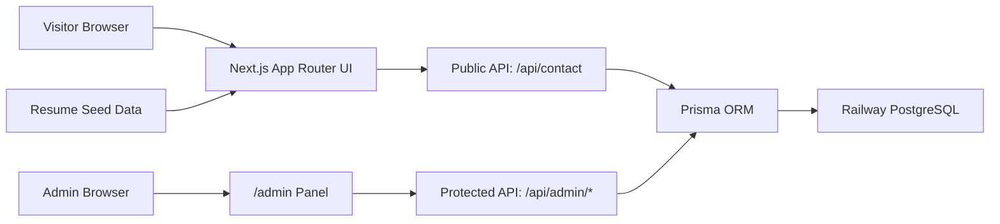

# Vatsal Rakholiya AI Portfolio

Interactive, database-backed portfolio for a data scientist. The site presents resume content as an AI operations interface with animated sections, Three.js visuals, project intelligence cards, contact capture, and a protected admin panel.

## System Architecture



## File Structure

```text
.
|-- prisma/
|   |-- migrations/          # PostgreSQL migration history
|   |-- schema.prisma        # Database models
|   `-- seed.ts              # Resume-based seed data loader
|-- src/
|   |-- app/
|   |   |-- admin/page.tsx   # Protected admin panel
|   |   |-- api/             # Login, logout, portfolio, contact APIs
|   |   |-- globals.css      # Visual system and animations
|   |   |-- layout.tsx       # Metadata and shell
|   |   `-- page.tsx         # Public portfolio route
|   |-- components/          # Portfolio, 3D visuals, admin, forms
|   |-- lib/                 # Prisma, auth, portfolio loader, seed data
|   `-- types/               # Shared portfolio types
|-- railway.json             # Runs Prisma migrations before deploy
|-- .env.example
|-- package.json
`-- tailwind.config.ts
```

## Database Schema

The production database uses PostgreSQL through Prisma.

Core tables:

- `Profile`: name, headline, location, email, phone, summary, social/resume links.
- `Experience`: role, company, dates, location, ordered serialized highlights.
- `Project`: title, subtitle, description, serialized technologies, serialized metrics, featured flag.
- `SkillGroup`: grouped skill names and serialized ordered skill items.
- `Education`: credential, institution, location, dates, GPA.
- `Publication`: title, identifier, publication date, summary.
- `ContactMessage`: visitor contact form submissions.
- `SiteText`: editable website copy for the admin panel.

## Admin Panel

Open `/admin`. The password is read from `ADMIN_PASSWORD`. The panel edits profile fields, site text, projects, experience, skills, education, and publications, then persists changes through `/api/admin/portfolio`.

## Railway Deployment

Required variables:

```text
DATABASE_URL=<Railway PostgreSQL connection string>
ADMIN_PASSWORD=<strong admin password>
SESSION_SECRET=<long random secret>
```

`railway.json` runs:

```bash
pnpm prisma migrate deploy
```

The app build runs:

```bash
pnpm build
```

The app start command is:

```bash
pnpm start
```

## Local Development

This repo is configured for PostgreSQL. Use a local PostgreSQL database or Railway's database URL in `.env`.

```bash
pnpm install
pnpm prisma migrate deploy
pnpm dev
```
